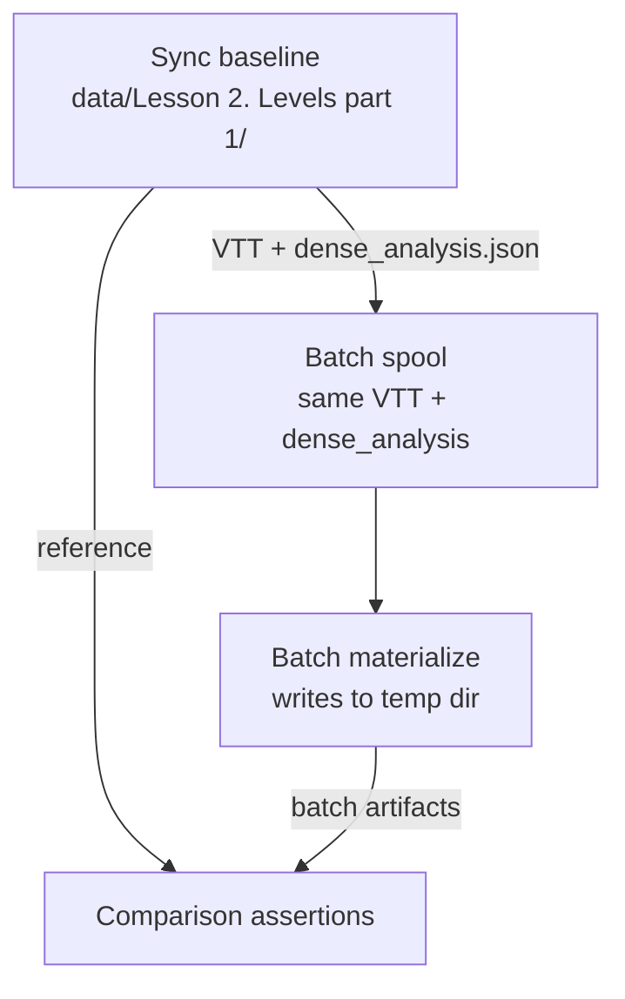

# Phase 13 -- Tests + Lesson 2 Comparison Testing Strategy

Implementation spec for all new batch tests and the three-layer Lesson 2
comparison plan.

---

## New batch test files

Additive; no existing tests deleted or weakened.

| File | Coverage |
|------|----------|
| `tests/test_gemini_batch_client.py` | Batch line shape, systemInstruction omission, key stability |
| `tests/test_state_store.py` | Schema auto-creates, upserts idempotent, attempt increments, summarize_status |
| `tests/test_request_keys.py` | make_request_key -> parse_request_key round-trip |
| `tests/test_batch_assembler.py` | Combines compatible fragments, does not mix stages, respects thresholds |
| `tests/test_batch_cli.py` | discover/plan/status no-op, spool/assemble/submit idempotent |
| `tests/test_dense_analyzer_batch.py` | Materialized vision output matches sync parser path, artifact shape invariants |
| `tests/test_llm_processor_batch.py` | Knowledge extract parses through `parse_knowledge_extraction()`, markdown render parses through `parse_markdown_render_result()`, llm_debug rows in expected shape |
| `tests/integration/test_batch_resume_flow.py` | discover -> plan -> spool -> assemble -> submit (fake) -> download (seeded) -> materialize; rerun confirms skip of completed work |

---

## Lesson 2 comparison testing strategy

Use **Lesson 2. Levels part 1** as the reference lesson. It has a complete set
of sync-produced artifacts and an existing regression test at
`tests/integration/test_lesson2_artifact_regression.py` with helpers in
`tests/regression_helpers.py`.

Three layers from cheapest/offline to full live:

### Layer 1: Schema + structural equivalence (offline, no API, CI-safe)

Feed **synthetic** batch result JSONL through materializers, verify output
passes all existing regression checks from `tests/regression_helpers.py`.

- `tests/test_dense_analyzer_batch.py` -- known frame text through batch
  materialize matches `_parse_json_from_response()` + `ensure_material_change()`
- `tests/test_llm_processor_batch.py` -- known extraction text through batch
  materialize produces identical `ChunkExtractionResult`

These tests construct fake Gemini batch response lines (with correct `key` and
`response.candidates[0].content.parts[0].text` structure) seeded from real
LLM text captured from existing Lesson 2 `llm_debug.json`.

### Layer 2: Artifact shape parity (offline, uses existing Lesson 2 data, CI-safe)

**New test file:** `tests/integration/test_batch_lesson2_parity.py`

Steps:

1. Load existing sync `knowledge_events.json` to get event count and event_id set
2. Capture LLM response text from existing `llm_debug.json`
3. Build synthetic batch result JSONL from the captured text
4. Feed through `materialize_batch_results_for_knowledge_extract()`
5. Compare:
   - Same event count
   - Same `event_id` set
   - Same `normalized_text` values
   - Same provenance fields
6. Run full regression assertions from `regression_helpers.py` on batch-produced artifacts:
   - `assert_knowledge_events_clean()`
   - `assert_rule_cards_provenance()`
   - `assert_cross_file_integrity()`

Downstream stages (evidence, rules, concept graph) are deterministic given
knowledge events, so equivalence cascades.

### Layer 3: Live end-to-end comparison (requires API, manual gate)

**New test file:** `tests/integration/test_batch_lesson2_live.py`

Gated by environment variable: `RUN_BATCH_LESSON2_LIVE=1`

Steps:

1. Run full batch workflow for Lesson 2 to a **temp directory** (never overwrite sync baseline)
2. Compare batch output against sync baseline with tolerances for LLM non-determinism:

| Artifact | Metric | Tolerance |
|----------|--------|-----------|
| knowledge_events | event count | +/-20% |
| rule_cards | rule count | +/-25% |
| evidence_index | backlink resolution | 100% required |
| concept_graph | node count | +/-30% |
| review_markdown | word count | +/-30% |
| all structured | schema validation | 100% pass |
| all structured | non-placeholder text | 100% required |

3. Print diff summary table:

```
| artifact         | sync_count | batch_count | delta_pct |
|------------------|------------|-------------|-----------|
| knowledge_events | 42         | 38          | -9.5%     |
| rule_cards       | 12         | 10          | -16.7%    |
| ...              | ...        | ...         | ...       |
```

### Data flow diagram



---

## Key reference: existing regression infrastructure

The following existing helpers in `tests/regression_helpers.py` are reused
by Layer 2 and Layer 3:

- `assert_knowledge_events_clean()` -- validates event structure, non-empty fields, unique IDs
- `assert_rule_cards_provenance()` -- validates rule card structure and source provenance
- `assert_cross_file_integrity()` -- validates referential integrity across artifacts
- `assert_evidence_backlinks()` -- validates evidence backlinks resolve to real events
- `assert_markdown_quality()` -- validates markdown word count and heading structure

The existing `tests/integration/test_lesson2_artifact_regression.py` exercises
all of these against sync-produced data. The new Layer 2/3 tests reuse the
same assertions against batch-produced data.
