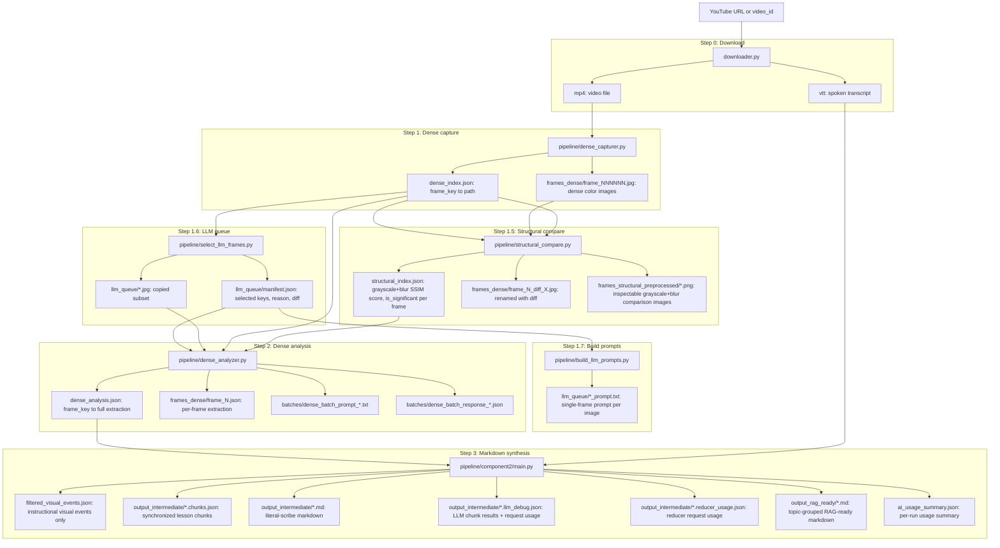

# Full pipeline (detailed)

This document describes both runnable pipelines in this repository:

1. The **main pipeline** run by `uv run tim-class-pass`
2. The **standalone Component 2 + Step 3 markdown pipeline** run by `uv run python -m pipeline.component2.main`

For **output layout, path contract, optional structured stages, and feature flags**, see **[pipeline_structure_and_features.md](pipeline_structure_and_features.md)**.

---

## Main pipeline overview

```
YouTube URL / existing video_id
        │
        ▼
[Step 0] downloader.py
        │
        ▼
[Step 1] pipeline/dense_capturer.py
        │
        ▼
[Step 1.5] pipeline/structural_compare.py
        │
        ▼
[Step 1.6] pipeline/select_llm_frames.py
        │
        ▼
[Step 1.7] pipeline/build_llm_prompts.py
        │
        ▼
[Step 2] pipeline/dense_analyzer.py
        │
        ▼
[Step 3] pipeline/component2/main.py
        │
        ▼
  filtered_visual_events.json  +  output_intermediate/*.md  +  output_rag_ready/*.md
```

Entry point: `uv run tim-class-pass --url "..."` or `uv run tim-class-pass --video_id "Folder Name"`. Alternative: `uv run python -m pipeline.main ...`.

---

## Main pipeline information flow (Mermaid)

Diagram: where each file is **generated** (arrow from step to file), where **consumed** (arrow into step), and what it **contains**.



**Notes:**

- **dense_index.json** is updated in Step 1.5 (paths change to `_diff_*.jpg`); Step 1.6 and Step 2 read the updated index.
- Step 2 **reads** `llm_queue/manifest.json` + `llm_queue/*.jpg` and **writes** `dense_batch_prompt_*.txt`, merges into **dense_analysis.json**. It also reads `batches/dense_batch_response_*.json` when re-run after the agent fills it.
- Step 3 **reads** `dense_analysis.json` and the selected `.vtt`, writes `filtered_visual_events.json`, writes Pass 1 artifacts under `output_intermediate/`, writes reducer usage, and refreshes `ai_usage_summary.json`.
- **llm_queue/\*_prompt.txt** files are generated for inspection or external use; Step 2 does not read those prompt files.

---

## Step 0: Download (optional)

**Script:** `pipeline/downloader.py`  
**Functions:** `extract_video_id(url)`, `download_video_and_transcript(url, video_id)`  
**When:** Only if you pass `--url`; skipped when using `--video_id`.

1. **Extract video ID:** Uses **yt-dlp** in extract-only mode (`extract_flat=True`) to get the video ID from the YouTube URL. Returns the ID or `None` on failure.
2. **Create directory:** Ensures `data/<video_id>/` exists (or the configured `DATA_DIR`).
3. **Download with yt-dlp:** Runs `yt-dlp.YoutubeDL` with:
   - Format: `bestvideo[ext=mp4]+bestaudio[ext=m4a]/best[ext=mp4]/best` so the primary output is MP4.
   - Output template: `data/<video_id>/%(id)s.%(ext)s` for both video and subtitles.
   - `writesubtitles=True`, `writeautomaticsub=True`, `subtitleslangs=['en', 'ru']`, `subtitlesformat='vtt'`.
   - `noplaylist=True` so only the single video is downloaded.
4. **Result:** On success, the video file is written as `data/<video_id>/<id>.mp4` (or similar) and subtitle files as `data/<video_id>/<id>.en.vtt`, `data/<video_id>/<id>.ru.vtt`, etc. The main pipeline later selects a `.vtt` from this folder (e.g. via config `vtt_file` or by convention).
5. **Skip condition:** The main pipeline does not re-download if you invoke it with `--video_id` and the folder already contains the expected assets.

**Outputs:** `data/<video_id>/<video>.mp4`, `data/<video_id>/*.vtt`.

---

## Step 1: Dense frame capture

**Script:** `pipeline/dense_capturer.py`  
**Function:** `extract_dense_frames(video_id, video_file_override=None, max_workers=None, capture_fps=...)`  
**Skip:** If `dense_index.json` and `frames_dense/` already exist, unless `--recapture` is set.

1. **Clean:** Removes existing `frames_dense/` and `dense_index.json` if present (so the run is full re-extraction).
2. **Resolve video file:** Uses `video_file_override` from pipeline config if set; otherwise the first `.mp4` in `data/<video_id>/`.
3. **FFmpeg:** Runs FFmpeg to extract dense color frames:
   - Default filter: `fps=0.5,scale=1280:-1` (0.5 fps, width 1280, height auto to preserve aspect).
   - Quality: `-qscale:v 2`.
   - Output pattern: `frames_dense/frame_%06d.jpg`. The capturer then renames and re-indexes so that frame numbers align with second-based keys: at 0.5 fps, frame 1 → key `000001`, frame 2 → `000002`, etc., so each key corresponds to one sampled second.
4. **Parallel segments (when enabled):** If `max_workers > 1` and video duration is known and > 60s, the video is split into ~60s segments. One FFmpeg process per segment runs in parallel (e.g. via `ProcessPoolExecutor` or similar), writing into temporary `frames_dense_seg_XXX/` directories. After all segments finish, frames are merged into `frames_dense/` with global second-based keys so the final index is contiguous and ordered.
5. **Index:** Builds a mapping from frame number (as 6-digit string key, e.g. `"000001"`) to the path under the video dir, e.g. `frames_dense/frame_000001.jpg`.
6. **Write:** Saves the index to `data/<video_id>/dense_index.json`.

**Outputs:**  
- `data/<video_id>/frames_dense/frame_NNNNNN.jpg` (dense color frames, keyed by sampled second).  
- `data/<video_id>/dense_index.json` (keys = frame keys, values = relative paths to those JPGs).

---

## Step 1.5: Structural compare (SSIM)

**Script:** `pipeline/structural_compare.py`  
**Function:** `run_structural_compare(video_id, force=False, rename_with_diff=True, max_workers=None)`  
**Skip:** If `structural_index.json` already exists, unless `force=True` (e.g. `--recompare` or `--recapture`).

1. **Load:** Reads `dense_index.json` and gets the sorted list of frame keys.
2. **Config:** Reads `ssim_threshold` and `compare_blur_radius` from pipeline config (defaults `0.95` and `1.5`). Frames with SSIM above the threshold are considered “unchanged” relative to the previous frame.
3. **Compare:** For each frame (except the first), optionally in parallel when `max_workers > 1`:
   - Loads previous and current color frames from `frames_dense/`.
   - Converts them to grayscale, optionally resizes current to match baseline size, applies Gaussian blur (`compare_blur_radius` from config, default 1.5), and calls `compare_images(prev_path, cur_path, threshold, blur_radius=...)` from `helpers/utils/compare.py`. The comparison uses SSIM (structural similarity) via skimage.
   - Stores for that frame: `previous_key`, `score`, `is_significant` (True if score &lt; threshold), `threshold`, `metadata`, `compare_seconds`. If `compare_artifacts_dir` is set in config, preprocessed grayscale/blur PNGs can be written for inspection.
   - The first frame has no previous frame; it gets a synthetic result: `score=1.0`, `is_significant=True`, `reason="first_frame"`.
4. **Rename (optional):** If `rename_with_diff=True` (default), for every frame:
   - Computes `diff = 1 - score` (e.g. `0.1014` for 10.14% difference).
   - Renames the file from e.g. `frame_000014.jpg` to `frame_000014_diff_0.1014.jpg`.
   - Updates `dense_index.json` so it points to the new filenames.
5. **Write:** Saves the per-frame comparison results to `data/<video_id>/structural_index.json`.

**Outputs:**  
- `data/<video_id>/structural_index.json` (per-frame SSIM and significance).  
- `data/<video_id>/frames_dense/frame_NNNNNN_diff_X.XXXX.jpg` (renamed; `dense_index.json` updated).  
- `data/<video_id>/frames_structural_preprocessed/*.png` (inspectable grayscale+blur comparison images).

---

## Step 1.6: LLM queue selection

**Script:** `pipeline/select_llm_frames.py`  
**Function:** `build_llm_queue(video_id, threshold=None)`  
**Depends on:** Step 1.5 must have run (frames must have `_diff_<value>` in the filename).

1. **Load:** Reads `dense_index.json` (keys and paths; paths now include `_diff_X.XXXX`).
2. **Parse diff:** For each frame, extracts the numeric diff from the filename via regex `_diff_([0-9]*\.[0-9]+)` (e.g. `0.6928` from `frame_000003_diff_0.6928.jpg`). If missing, treats diff as `0.0`.
3. **Select:**
   - Any frame with `diff > threshold` (default from config, now typically **0.025**) is selected with reason `"above_threshold"`.
   - For every such frame, the **immediately previous** frame is also selected (if not already), with reason `"previous_of_threshold"`, so each “change” has context.
4. **Copy:** Copies the selected frame files (from `frames_dense/`) into `data/<video_id>/llm_queue/` (same filenames). Skips copy if the file already exists in `llm_queue/`.
5. **Manifest:** Writes `llm_queue/manifest.json` with: `video_id`, `threshold`, `total_selected`, `copied`, and `items` (per selected frame: `reason`, `diff`, `source` path).

**Outputs:**  
- `data/<video_id>/llm_queue/*.jpg` (subset of frames; filenames like `frame_000003_diff_0.6928.jpg`).  
- `data/<video_id>/llm_queue/manifest.json`.

**Note:** Step 2 **requires** `llm_queue/manifest.json` and runs **only** the queued frames. Non-queue frames get minimal entries so `dense_analysis.json` still has a full key set for downstream filtering and synthesis.

---

## Step 1.7: Build LLM prompts

**Script:** `pipeline/build_llm_prompts.py`  
**Function:** `build_llm_prompts(video_id)`  
**Depends on:** `llm_queue/manifest.json` (Step 1.6).

1. **Load:** Reads `llm_queue/manifest.json` and gets the `items` dict (selected frame key → `reason`, `diff`, `source`).
2. **Per selected frame:** For each item, resolves the image path under `data/<video_id>/` (using `source`). If the image file exists:
   - Builds prompt text via `_build_prompt(frame_key, image_path)`:
     - Uses the **single-frame prompt** constant `SINGLE_FRAME_PROMPT` (no “previous frame” or “material change vs previous” logic).
     - Appends: “Analyze this single frame. Frame key: … Image path: …” and “Return only valid JSON, no markdown or explanation.”
   - Writes the prompt to `llm_queue/<image_stem>_prompt.txt` (e.g. `frame_000003_diff_0.6928_prompt.txt`).
3. **Overwrite:** Existing `*_prompt.txt` files are overwritten.

**Outputs:**  
- `data/<video_id>/llm_queue/<stem>_prompt.txt` for each selected image (e.g. `frame_000003_diff_0.6928_prompt.txt`).

These prompts are ready for single-frame analysis (e.g. by an external runner). Step 2 uses the queue images but does not read the `*_prompt.txt` files; it builds its own batch prompts in `dense_analyzer`.

---

## Step 2: Dense analysis (batched, agent-driven)

**Script:** `pipeline/dense_analyzer.py`  
**Function:** `run_analysis(video_id, batch_size, agent, parallel_batches=False, merge_only=False)`  
**Depends on:** `dense_index.json`, `llm_queue/manifest.json` (required), and optionally `structural_index.json`.  
**Uses:** Only frames listed in `llm_queue/manifest.json` (images from `llm_queue/`). Non-queue frames are prefills for downstream synthesis.

High-level flow:

1. **Config:** Loads pipeline config (e.g. `ssim_threshold`, `telemetry_enabled`). Resolves paths: `dense_index.json`, `dense_analysis.json`, `batches/`.
2. **Merge-only mode:** If `--merge-only` was passed (e.g. after parallel subagents finished):
   - Finds all `batches/dense_batch_response_*.json`.
   - Merges them into one dict keyed by frame key, sorts by key, writes `dense_analysis.json`.
   - For each frame in the merged result, writes `frames_dense/frame_<key>.json` with that frame’s entry.
   - Optionally writes processing-status telemetry. Then returns; no further steps.
3. **Load index and structural index:** Reads `dense_index.json` (all frame keys and paths). Loads `structural_index.json` if present (used for auto-skip and for passing `structural_score` / `compare_seconds` into the analyzer).
4. **Parallel-batches (Option B):** If `parallel_batches` and agent is `ide`:
   - Generates one task per batch: for each batch of `batch_size` consecutive keys, builds an independent batch prompt (no previous-state dependency), writes `batches/task_<start>-<end>.json` with `prompt_content`, `frame_paths`, `response_file`, `batch_label`.
   - Writes `batches/manifest.json` with list of task/response files and `merge_after: true`.
   - Prints that the user should spawn subagents and then re-run with `--merge-only`. Exits with code 10.
5. **Load or init analysis:** If `dense_analysis.json` exists, loads it; otherwise starts with an empty dict. Computes `remaining_keys = all_keys - already in analysis`.
6. **Auto-skip using structural index:** For each key in `remaining_keys`, if `structural_index` says `is_significant` is False for that frame, creates a minimal “no change” entry (e.g. `minimal_no_change_frame(key)`), adds `structural_score` and `compare_seconds` if present, writes it into `analysis` and appends to `dense_analysis.json`, then removes that key from `remaining_keys`. So frames that are structurally unchanged vs the previous frame never go to the LLM.
7. **Next batch:** If no keys remain, prints “All frames already analyzed” and returns. Otherwise takes the next `batch_size` keys from `remaining_keys`, builds:
   - `batch_entries = [(key, path), ...]` using paths from `dense_index`.
   - A batch prompt that includes the production prompt, previous frame state (last analyzed frame’s JSON), and the list of frames in this batch.
8. **Write batch prompt:** Saves the prompt to `batches/dense_batch_prompt_<start>-<end>.txt` and the response path as `batches/dense_batch_response_<start>-<end>.json`.
9. **IDE agent:** If agent is `ide` and the response file does not exist:
   - Writes `batches/last_agent_task.json` with `prompt_file`, `response_file`, `type: "batch"`, `frame_paths`, `prompt_content`.
   - Prints that the agent must write the response to that JSON file. Exits with code 10. The user/IDE fills the response and re-runs `tim-class-pass` (or `python -m pipeline.main`).
10. **API agents (OpenAI, Gemini, MLX, Setra):** If the response file does not exist, for each frame in the batch:
    - Builds a single-frame prompt (with previous state for context).
    - Optionally uses `structural_index` to skip or to pass `structural_score`/`compare_seconds`; if `is_significant` is False, uses minimal no-change entry and does not call the API.
    - Otherwise calls the vision/chat API (OpenAI or Gemini), parses the JSON response, normalizes with `ensure_material_change`, and stores the entry. Writes the full batch result to `dense_batch_response_<start>-<end>.json`.
11. **Merge batch:** Reads the batch response file, merges into `analysis`, then for each frame in the batch writes `frames_dense/frame_<key>.json` and updates `dense_analysis.json`. Writes processing-status telemetry if enabled.
12. **Loop or exit:** If more keys remain, the next run of the pipeline will process the next batch (step 7 onward). If all keys are done, Step 2 returns and the pipeline continues to Step 3.

**Outputs:**  
- `data/<video_id>/dense_analysis.json` (full per-frame analysis; updated after each batch).  
- `data/<video_id>/frames_dense/frame_<key>.json` (per-frame extraction).  
- `data/<video_id>/batches/dense_batch_prompt_<start>-<end>.txt`, `dense_batch_response_<start>-<end>.json` (and, for IDE, `last_agent_task.json`).  
- `data/<video_id>/ai_usage_summary.json` (request/token summary rebuilt from inline usage records).  
- Optionally `batches/task_*.json` and `batches/manifest.json` when using parallel-batches mode.

---

## Step 3: Component 2 + markdown synthesis (detailed)

**Script:** `pipeline/component2/main.py` (orchestration), `pipeline/invalidation_filter.py`, `pipeline/component2/parser.py`, `pipeline/component2/llm_processor.py`, `pipeline/component2/quant_reducer.py`, and optionally `knowledge_builder.py`, `evidence_linker.py`, `rule_reducer.py`, `exporters.py`.  
**Function:** `run_component2_pipeline(...)`  
**Depends on:** `dense_analysis.json` (from Step 2) and a `.vtt` transcript in the same output root (or paths passed to the standalone CLI).

All paths are resolved via `PipelinePaths` in `pipeline/contracts.py`; output directories are created with `paths.ensure_output_dirs()`. The step runs in order below. Optional stages (knowledge extraction, evidence linking, rule cards, exporters) are gated by flags; see [pipeline_structure_and_features.md](pipeline_structure_and_features.md).

---

### Step 3.1 — Preflight and invalidation filter

1. **Preflight (main pipeline only):** When Step 3 is invoked from the main pipeline, `prepare_component2_run()` runs first: it writes a pipeline inspection report to `pipeline_inspection.json` (path from `paths.inspection_report_path()`), which lists resolvable stages from `pipeline/stage_registry.py` and artifact checks. Standalone Component 2 CLI can skip or reuse this.

2. **Load dense analysis:** Reads `dense_analysis.json` (or the path given as `visuals_json_path`). The file must be a JSON object keyed by frame key (e.g. `"000001"`); each value is a per-frame extraction dict with at least `material_change`, `visual_representation_type`, `change_summary`, `current_state`, `extracted_entities`, and optionally `educational_event_type`, `screen_type`, `frame_timestamp`.

3. **Filter to instructional events:** `filter_visual_events(raw_analysis)` in `pipeline/invalidation_filter.py` iterates frames in sorted key order and keeps an entry only if `is_valid_visual_event(entry)` is true:
   - **Requirement:** `entry["material_change"]` must be truthy; otherwise the frame is rejected with reason `"no_material_change"`.
   - **Known visual types:** If `visual_representation_type` is not in the unknown set (`""`, `"n/a"`, `"na"`, `"none"`, `"null"`, `"unknown"`), the entry is kept.
   - **Unknown type:** If the type is unknown, the entry is kept only if `_has_instructional_signal(entry)` returns true. That function:
     - Rejects if `change_summary` (or similar text) contains any of `NEGATIVE_INSTRUCTIONAL_PHRASES` (e.g. "no direct trading information", "generic transition") unless the entry also has explicit markup: non-empty `visible_annotations`, `drawn_objects`, `structural_pattern_visible`, or non-empty `extracted_entities`.
     - Keeps if `change_summary` or `educational_event_type` contains any of `INSTRUCTIONAL_CHANGE_KEYWORDS` (e.g. "annot", "arrow", "diagram", "draw", "highlight", "label", "slide", "text", "trendline").
     - Keeps if `current_state` has non-empty `visible_annotations`, `drawn_objects`, or `structural_pattern_visible`.
     - Keeps if `cursor_or_highlight` contains an instructional keyword.
     - Keeps if `extracted_entities` has meaningful content.
     - Keeps if `screen_type` is one of `slides`, `chart_with_annotation`, `chart`, `browser`, `platform` and one of the above markup or `visual_facts` conditions holds.
   - Each kept entry is normalized to a `VisualEvent` (timestamp_seconds, frame_key, visual_representation_type, example_type, change_summary, current_state, extracted_entities) via `_normalize_visual_event`.

4. **Debug report:** `build_debug_report(raw_analysis, events)` produces a dict with `input_frames`, `kept_events`, `rejected_frames`, `kept_frame_keys`, `rejected_frame_keys` (map of frame_key → rejection_reason).

5. **Write:** Filtered events are written to `paths.filtered_visuals_path` (`filtered_visual_events.json`) and the debug report to `paths.filtered_visuals_debug_path` (`filtered_visual_events.debug.json`), using atomic writes from `pipeline/io_utils.py`.

---

### Step 3.2 — Parse VTT and synchronize with visual events

1. **Parse VTT:** `parse_vtt(vtt_path)` in `pipeline/component2/parser.py` loads the transcript. It tries the `webvtt` library first; on failure it falls back to `_parse_vtt_manually`, which scans the file for lines matching `HH:MM:SS.mmm --> HH:MM:SS.mmm` and collects the following non-empty lines as caption text. Each segment becomes a `TranscriptLine` (start_seconds, end_seconds, text). Timestamps are converted to float seconds; caption text is cleaned (WebVTT tags removed, entities normalized, whitespace collapsed).

2. **Load filtered events:** `parse_filtered_visual_events(events_path)` reads `filtered_visual_events.json`, validates it as a JSON array, deserializes each item to `VisualEvent`, and sorts by `(timestamp_seconds, frame_key)`.

3. **Create lesson chunks:** `create_lesson_chunks(vtt_lines, visual_events, target_duration_seconds)` (default 120.0) builds semantic chunks:
   - Iterates over transcript lines in order. For each chunk it accumulates lines until a cut condition is met.
   - **Cut when:** (a) there is no next line, or (b) the current chunk duration is at least `target_duration_seconds` and either the current line ends a sentence (terminal punctuation like `.` `!` `?` …) or the gap to the next line is greater than 1.5 seconds. This keeps chunks roughly target-length while respecting sentence and pause boundaries.
   - For each chunk it computes `chunk_start` and `chunk_end` from the first and last line. It assigns every visual event whose `timestamp_seconds` lies in `[chunk_start, chunk_end]` to that chunk. The last event’s `current_state` is carried forward as `previous_visual_state` for the next chunk.
   - Each chunk is a `LessonChunk`: chunk_index, start_time_seconds, end_time_seconds, transcript_lines, visual_events, previous_visual_state.

4. **Write chunks:** The list of chunks is written to `paths.lesson_chunks_path(lesson_name)` (`output_intermediate/<lesson>.chunks.json`) as a JSON array of serialized `LessonChunk`s.

---

### Step 3.3 — Optional: Knowledge extraction (step3_2b)

**When:** `--enable-knowledge-events` (or equivalent flag). Requires chunks to exist.

1. **Adapt chunks:** Raw chunks (from the previous step) are adapted to `AdaptedChunk` format (lesson_id, chunk_index, section, transcript_text, visual_events, etc.) via `adapt_chunks()` in `pipeline/component2/knowledge_builder.py`. Transcript text is built from transcript lines; time bounds and metadata are attached.

2. **Extract per chunk:** For each adapted chunk, the pipeline calls the LLM in knowledge-extraction mode (`process_chunks_knowledge_extract` in `llm_processor.py`). Visual events are summarized (with optional compaction) and passed along with transcript text in a structured prompt. The model returns a `ChunkExtractionResult` (e.g. statements with text, concept, subconcept, provenance). Concurrency is capped by `max_concurrency`; progress is reported per chunk.

3. **Build knowledge events:** `build_knowledge_events_from_extraction_results()` maps extraction results to a `KnowledgeEventCollection`. It infers concept/subconcept from text and visuals where missing, scores event confidence, normalizes statement text, dedupes statements, and attaches provenance (chunk index, timestamps, source event IDs). Each event gets a stable `event_id`.

4. **Write:** The collection is written to `paths.knowledge_events_path(lesson_name)` and debug rows to `paths.knowledge_debug_path(lesson_name)`.

---

### Step 3.4 — Optional: Evidence linking (step4)

**When:** `--enable-evidence-linking`. Requires knowledge events (from this run or an existing file).

1. **Load:** Knowledge events are loaded from `paths.knowledge_events_path(lesson_name)` if not already in memory. Chunks are already in memory (or reloaded from `paths.lesson_chunks_path(lesson_name)`).

2. **Adapt and enrich visuals:** `adapt_visual_events_from_chunks(chunks, lesson_id)` builds a list of visual events with chunk context. If `dense_analysis` is provided, `enrich_visual_event_from_dense_analysis()` merges in per-frame fields (e.g. change_summary, current_state) from the dense analysis so each candidate has full context.

3. **Group into candidates:** `group_visual_events_into_candidates()` groups consecutive visual events that belong to the same chunk and are close in time (or split on chunk boundary / large time gap). Each group becomes a `VisualEvidenceCandidate` (time range, compact summary, metadata, raw event IDs).

4. **Link to knowledge events:** `link_candidates_to_knowledge_events(candidates, knowledge_events, threshold)` scores each candidate against each knowledge event (e.g. by time overlap, concept hint overlap, text similarity). Pairs above the link threshold are kept. Each candidate is converted to an `EvidenceRef` (evidence_id, compact_visual_summary, linked knowledge event IDs, source event IDs, metadata) via `candidate_to_evidence_ref()`; visual summaries are compacted to avoid leaking raw blobs.

5. **Write:** An `EvidenceIndex` (schema_version, lesson_id, lesson_title, evidence_refs) is written to `paths.evidence_index_path(lesson_name)` and debug rows to `paths.evidence_debug_path(lesson_name)`.

---

### Step 3.5 — Optional: Rule cards (step4b)

**When:** `--enable-rule-cards`. Requires knowledge events and evidence index.

1. **Load:** `KnowledgeEventCollection` from `paths.knowledge_events_path(lesson_name)` and `EvidenceIndex` from `paths.evidence_index_path(lesson_name)`.

2. **Group events into rule candidates:** `group_events_into_rule_candidates(events, evidence_index, threshold)` clusters knowledge events that share concept/subconcept and similar time/chunk context. Events are classified as primary (rule-like), condition, invalidation, exception, etc., and routed into `RuleCandidate` objects. Compatibility is based on role and text similarity.

3. **Attach evidence:** `attach_evidence_to_candidates(candidates, evidence_index)` links each candidate to the evidence refs whose source event IDs overlap the candidate’s event IDs.

4. **Merge and split:** Duplicate primary events within a candidate are merged. Candidates that are too broad (e.g. multiple subconcepts or low similarity) are split via `split_overbroad_candidate()` into smaller candidates.

5. **Convert to rule cards:** For each final candidate, `candidate_to_rule_card()` builds a `RuleCard`: canonical rule text (chosen from primary events), conditions, invalidation, exceptions, algorithm notes, example refs, confidence score, evidence_refs, concept, subconcept, etc. Visual summaries are trimmed via compaction config.

6. **Write:** A `RuleCardCollection` is written to `paths.rule_cards_path(lesson_name)` and debug rows to `paths.rule_debug_path(lesson_name)`.

---

### Step 3.55 — Optional: Concept graph (step12)

**When:** `--enable-concept-graph`. Requires rule cards (from run or existing file).

1. **Load:** `RuleCardCollection` from `paths.rule_cards_path(lesson_name)` (or use in-memory rule_cards if step4b just ran).

2. **Build graph:** `build_concept_graph(rule_cards)` in `pipeline/component2/concept_graph.py` creates nodes from unique concepts and subconcepts, then adds typed relations: `parent_of`/`child_of` from concept–subconcept pairs, `related_to` for sibling subconcepts, `precedes` from source chunk order within a concept family, `depends_on` from dependency cues in text, `contrasts_with` from name pairs and comparison cues, `supports` from support-like subconcept names. All relation creation is conservative and deterministic.

3. **Write:** A `ConceptGraph` (lesson_id, nodes, relations) is written to `paths.concept_graph_path(lesson_name)` and debug rows to `paths.concept_graph_debug_path(lesson_name)`.

When exporters run and the concept graph file exists, the review markdown can include an optional "## Concept relationships" section (one line per relation).

---

### Step 3.6 — Optional: Exporters (step5)

**When:** `--enable-exporters`. Requires rule cards and evidence index.

1. **Load:** Rule cards from `paths.rule_cards_path(lesson_name)` and evidence index from `paths.evidence_index_path(lesson_name)`. Optionally knowledge events for context.

2. **Build export context:** `build_export_context()` builds an `ExportContext`: lesson_id, lesson_title, rule_cards, evidence_refs, evidence_by_id map, compaction config.

3. **Render review markdown:** By default `render_review_markdown_deterministic(ctx)` builds the review document: title, then for each concept group (from `group_rule_cards_for_export`), sorted rule cards and for each rule a block with rule text, conditions, invalidation, evidence refs, and compact provenance. Empty sections are omitted. If `--use-llm-review-render` is set, an LLM can be used to render the review markdown instead.

4. **Render RAG markdown:** `render_rag_markdown_deterministic(ctx)` builds a compact RAG document: title, then concept groups and for each rule a short block (subconcept, rule text, conditions, invalidation, algorithm notes, visual summary bullets). No verbose provenance. If `--use-llm-rag-render` is set, an LLM can render the RAG markdown.

5. **Write:** Review markdown is written to `paths.review_markdown_path(lesson_name)` (`output_review/<lesson>.review_markdown.md`), RAG markdown to `paths.rag_ready_export_path(lesson_name)` (`output_rag_ready/<lesson>.rag_ready.md`). Optional render debug JSON is written when LLM render was used. The export manifest is built with `build_export_manifest()` (only existing artifact paths included) and written to `paths.export_manifest_path(lesson_name)` via `write_artifact_manifest()`.

---

### Step 3.7 — Legacy: Pass 1 literal-scribe markdown

**When:** Default (or unless `--no-preserve-legacy-markdown`). Always runs after chunks are written unless legacy is disabled.

1. **Per-chunk prompt:** For each `LessonChunk`, `build_legacy_markdown_prompt(chunk)` (in `llm_processor.py`) builds the user message: `<previous_visual_state>` (JSON), `<transcript>` (lines with `[MM:SS]` prefix), `<visual_events>` (per-event timestamp, example_type, visual_representation_type, change_summary, current_state, extracted_entities). The system prompt is the Literal Scribe: translate to English, preserve chronology and information density, integrate visual deltas, output structured JSON.

2. **Call provider:** Each chunk is processed (e.g. via `process_chunks()`) with the configured provider and model; the response is parsed as `EnrichedMarkdownChunk` (synthesized_markdown, metadata_tags). Concurrency is limited by `max_concurrency`; order is preserved.

3. **Assemble Pass 1 document:** `assemble_video_markdown(lesson_name, processed_chunks)` sorts by chunk_index, formats each chunk’s markdown (and appends "**Tags:** " + metadata_tags if present), joins with "---", and prepends a "# {lesson_name}" header.

4. **Write:** The assembled markdown is written to `paths.pass1_markdown_path(lesson_name)` (`output_intermediate/<lesson>.md`). Per-chunk debug (chunk index, times, result, request_usage) is written to `paths.llm_debug_path(lesson_name)` (`output_intermediate/<lesson>.llm_debug.json`).

---

### Step 3.8 — Legacy: Pass 2 quant reducer

**When:** Same as Pass 1 (legacy flow enabled).

1. **Single document call:** `synthesize_full_document(raw_markdown, video_id, model, provider)` in `pipeline/component2/quant_reducer.py` sends the full Pass 1 markdown to the reducer model (resolved via config/env, default e.g. `gemini-2.5-flash-lite`). The system prompt (`QUANT_SYSTEM_PROMPT`) instructs the model to act as Quantitative Trading Architect: discard narrative fluff, reorganize by trading topics (## headers), synthesize visual clusters, preserve verification timestamps, and output YAML frontmatter with deduplicated tags.

2. **Response:** The model returns a single markdown string (topic-grouped, rule-oriented). Usage records are collected.

3. **Write:** The reduced markdown is written to `paths.rag_ready_markdown_path(lesson_name)` (`output_rag_ready/<lesson>.md`). Reducer usage is written to `paths.reducer_usage_path(lesson_name)` (`output_intermediate/<lesson>.reducer_usage.json`). The pipeline may also update `ai_usage_summary.json` in the video root.

---

### Step 3.9 — Result and manifest

The orchestrator builds the return dict of output paths using `maybe_add_output()`: only paths that exist are included (e.g. inspection_report_path, filtered_events_path, chunk_debug_path, knowledge_events_path, evidence_index_path, rule_cards_path, concept_graph_path, concept_graph_debug_path, review_markdown_path, rag_ready_markdown_path, rag_ready_export_path, export_manifest_path, plus legacy paths when applicable). When exporters ran, the export manifest was already written with only existing artifacts.

**Outputs (depending on flags):**  
- `filtered_visual_events.json`, `filtered_visual_events.debug.json`  
- `output_intermediate/<lesson>.chunks.json`  
- `output_intermediate/<lesson>.md`, `output_intermediate/<lesson>.llm_debug.json`, `output_intermediate/<lesson>.reducer_usage.json` (legacy)  
- `output_rag_ready/<lesson>.md` (legacy RAG-ready)  
- Optional: `output_intermediate/<lesson>.knowledge_events.json`, `*.knowledge_debug.json`, `*.evidence_index.json`, `*.evidence_debug.json`, `*.rule_cards.json`, `*.rule_debug.json`, `*.concept_graph.json`, `*.concept_graph_debug.json`  
- Optional: `output_review/<lesson>.review_markdown.md`, `output_rag_ready/<lesson>.rag_ready.md`, `output_review/<lesson>.export_manifest.json`  
- Optional: `pipeline_inspection.json`

---

## Output files summary

| Path | Step | Description |
|------|------|-------------|
| `data/<video_id>/*.mp4`, `*.vtt` | 0 | Video and source transcripts (yt-dlp). |
| `data/<video_id>/frames_dense/frame_*_diff_*.jpg` | 1, 1.5 | Dense color frames; filenames include SSIM diff. |
| `data/<video_id>/dense_index.json` | 1, 1.5 | Frame key → path to JPG. |
| `data/<video_id>/structural_index.json` | 1.5 | Per-frame SSIM score and `is_significant`. |
| `data/<video_id>/frames_structural_preprocessed/*.png` | 1.5 | Inspectable grayscale+blur images used by structural compare. |
| `data/<video_id>/llm_queue/*.jpg`, `manifest.json` | 1.6 | Selected frames (Step 2 input). |
| `data/<video_id>/llm_queue/*_prompt.txt` | 1.7 | Single-frame prompts (optional/external use). |
| `data/<video_id>/dense_analysis.json` | 2 | Full per-frame extraction (merged). |
| `data/<video_id>/ai_usage_summary.json` | 2, 3 | Aggregated request/token summary from inline usage records. |
| `data/<video_id>/frames_dense/frame_*.json` | 2 | Per-frame extraction JSON. |
| `data/<video_id>/batches/dense_batch_*`, `last_agent_task.json` | 2 | Batch prompts/responses and batch-agent state. |
| `data/<video_id>/pipeline_inspection.json` | 3 | Preflight: stage registry and artifact checks. |
| `data/<video_id>/filtered_visual_events.json` | 3 | Filtered instructional visual events. |
| `data/<video_id>/filtered_visual_events.debug.json` | 3 | Filter report and rejected frame reasons. |
| `data/<video_id>/output_intermediate/*.chunks.json` | 3 | Synchronized lesson chunks (transcript + visual events). |
| `data/<video_id>/output_intermediate/*.md` | 3 | Pass 1 literal-scribe markdown. |
| `data/<video_id>/output_intermediate/*.llm_debug.json` | 3 | LLM result debug output with per-chunk request usage. |
| `data/<video_id>/output_intermediate/*.reducer_usage.json` | 3 | Pass 2 reducer request usage. |
| `data/<video_id>/output_rag_ready/*.md` | 3 | Legacy final topic-grouped RAG-ready markdown. |
| `data/<video_id>/output_intermediate/*.knowledge_events.json` | 3 | Optional: atomic knowledge events (--enable-knowledge-events). |
| `data/<video_id>/output_intermediate/*.knowledge_debug.json` | 3 | Optional: knowledge extraction debug. |
| `data/<video_id>/output_intermediate/*.evidence_index.json` | 3 | Optional: evidence linked to knowledge events (--enable-evidence-linking). |
| `data/<video_id>/output_intermediate/*.evidence_debug.json` | 3 | Optional: evidence linking debug. |
| `data/<video_id>/output_intermediate/*.rule_cards.json` | 3 | Optional: rule cards from events + evidence (--enable-rule-cards). |
| `data/<video_id>/output_intermediate/*.rule_debug.json` | 3 | Optional: rule card build debug. |
| `data/<video_id>/output_intermediate/*.concept_graph.json` | 3 | Optional: lesson-level concept graph (--enable-concept-graph). |
| `data/<video_id>/output_intermediate/*.concept_graph_debug.json` | 3 | Optional: concept graph relation debug. |
| `data/<video_id>/output_review/*.review_markdown.md` | 3 | Optional: review markdown from exporters (--enable-exporters). |
| `data/<video_id>/output_rag_ready/*.rag_ready.md` | 3 | Optional: RAG markdown from exporters (--enable-exporters). |
| `data/<video_id>/output_review/*.export_manifest.json` | 3 | Optional: export manifest (existing artifacts only). |

---

## CLI flags (tim-class-pass / pipeline.main)

The main CLI is implemented with **Click** in `pipeline/main.py` and invoked via the `tim-class-pass` console script.

| Flag | Effect |
|------|--------|
| `--url URL` | Download video and VTT first (Step 0); then run pipeline. |
| `--video_id ID` | Use existing `data/<ID>/` (skip Step 0). |
| `--agent-images`, `--agent` | Choose agent for Step 2 (ide, openai, gemini, mlx, setra). |
| `--batch-size N` | Frames per batch in Step 2 (default from config or 10). |
| `--workers N` | Max workers for Step 1 + Step 1.5 (cap 8; default `floor(cpu_count / 2)`). |
| `--recapture` | Force Step 1 to re-extract frames and re-run 1.5–1.7. |
| `--recompare` | Force Step 1.5 to recompute structural index. |
| `--parallel` | Step 2: generate all batch task files + manifest, exit 10; then run with `--merge-only` after subagents finish. |
| `--merge-only` | Step 2: merge all `dense_batch_response_*.json` into `dense_analysis.json`, write per-frame JSONs, then run Step 3. |

Config for the dense pipeline is loaded from `data/<video_id>/pipeline.yml` using the `default` section. CLI overrides where applicable.

---

## Component 2 + Step 3 markdown pipeline

This is a separate pipeline branch for producing RAG-ready markdown after you already have:

- a raw `.vtt` transcript
- a dense frame-analysis JSON such as `dense_analysis.json`

Entry point:

```bash
uv run python -m pipeline.component2.main \
  --vtt "data/<video_id>/<lesson>.vtt" \
  --visuals-json "data/<video_id>/dense_analysis.json" \
  --output-root "data/<video_id>" \
  --video-id "<video_id>"
```

### What it does

1. `pipeline/invalidation_filter.py`
   - reads the dense frame-analysis JSON
   - keeps only instructional visual events
   - writes `filtered_visual_events.json`
2. `pipeline/component2/parser.py`
   - parses the VTT
   - synchronizes transcript lines and filtered visual events
   - produces semantic `LessonChunk` objects
3. `pipeline/component2/llm_processor.py`
   - builds provider-backed structured-output prompts
   - translates and merges transcript + visual deltas
   - returns `EnrichedMarkdownChunk` objects
4. `pipeline/component2/main.py`
   - orchestrates the full flow
   - writes markdown plus debug artifacts

### Outputs

```text
<output-root>/
├── filtered_visual_events.json
├── filtered_visual_events.debug.json
├── output_intermediate/
│   ├── <lesson_name>.md
│   ├── <lesson_name>.chunks.json
│   ├── <lesson_name>.llm_debug.json
│   └── <lesson_name>.reducer_usage.json
└── output_rag_ready/
    └── <lesson_name>.md
```

### CLI flags

| Flag | Effect |
|------|--------|
| `--vtt` | Required path to the raw transcript |
| `--visuals-json` | Required path to dense frame-analysis JSON |
| `--output-root` | Optional output folder; defaults to the VTT parent |
| `--video-id` | Optional config/model lookup hint |
| `--model` | Optional markdown model override |
| `--provider` | Optional markdown provider override |
| `--reducer-model` | Optional reducer model override |
| `--reducer-provider` | Optional reducer provider override |
| `--target-duration-seconds` | Target semantic chunk size (seconds) before extending to a sentence boundary; default 120 |
| `--max-concurrency` | Max simultaneous LLM chunk requests (Pass 1 and knowledge extraction) |
| `--enable-knowledge-events` | Run knowledge extraction from chunks → write `*.knowledge_events.json` |
| `--enable-evidence-linking` | Link visual evidence to knowledge events → write `*.evidence_index.json` (requires knowledge events) |
| `--enable-rule-cards` | Build rule cards from knowledge_events + evidence_index → write `*.rule_cards.json` |
| `--enable-concept-graph` | Build concept graph from rule_cards (Task 12) → write `*.concept_graph.json` (requires rule_cards) |
| `--enable-exporters` | Render `*.review_markdown.md` and `*.rag_ready.md` from rule_cards + evidence (requires rule_cards and evidence_index) |
| `--no-preserve-legacy-markdown` | Skip legacy Pass 1 + Pass 2 markdown synthesis (Steps 3.3–3.5) |
| `--enable-new-markdown-render` | Alternative render from rule_cards + evidence to `output_intermediate/*.review.md` |
| `--use-llm-review-render` | Use LLM to render review markdown when exporters are enabled |
| `--use-llm-rag-render` | Use LLM to render RAG markdown when exporters are enabled |

### Model selection

The markdown pipeline resolves models in this order:

1. `--model`
2. env `MODEL_COMPONENT2`
3. env `MODEL_VLM`
4. env `MODEL_NAME`
5. default `gemini-2.5-flash-lite`

Gemini access still uses the shared `helpers/clients/gemini_client.py` transport/retry layer.
