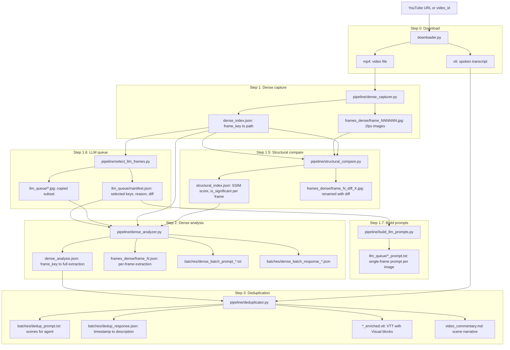

# Full pipeline (detailed)

This document describes every step of the multimodal transcript enrichment pipeline as run by `pipeline/main.py`. For the deduplicator alone, see [deduplicator.md](deduplicator.md).

---

## Overview

```
YouTube URL / existing video_id
        │
        ▼
[Step 0] downloader.py
        │
        ▼
[Step 1] pipeline/dense_capturer.py
        │
        ▼
[Step 1.5] pipeline/structural_compare.py
        │
        ▼
[Step 1.6] pipeline/select_llm_frames.py
        │
        ▼
[Step 1.7] pipeline/build_llm_prompts.py
        │
        ▼
[Step 2] pipeline/dense_analyzer.py
        │
        ▼
[Step 3] pipeline/deduplicator.py
        │
        ▼
  *_enriched.vtt  +  video_commentary.md
```

Entry point: `uv run pipeline/main.py --url "..."` or `uv run pipeline/main.py --video_id "Folder Name"`.

---

## Information flow (Mermaid)

Diagram: where each file is **generated** (arrow from step to file), where **consumed** (arrow into step), and what it **contains**.



**Notes:**

- **dense_index.json** is updated in Step 1.5 (paths change to `_diff_*.jpg`); Step 1.6 and Step 2 read the updated index.
- Step 2 **reads** `llm_queue/manifest.json` + `llm_queue/*.jpg` and **writes** `dense_batch_prompt_*.txt`, merges into **dense_analysis.json**. It also reads `batches/dense_batch_response_*.json` when re-run after the agent fills it.
- Step 3 **reads** `dense_analysis.json` and (when agent is API) **writes** `dedup_response.json`; when agent is IDE it **reads** `dedup_response.json` after the user creates it.
- **llm_queue/\*_prompt.txt** files are generated for inspection or external use; Step 2 does not read those prompt files.

---

## Step 0: Download (optional)

**Script:** `downloader.py`  
**When:** Only if you pass `--url`; skipped when using `--video_id`.

1. Extracts the video ID from the YouTube URL.
2. Creates `data/<video_id>/` if needed.
3. Runs **yt-dlp** to download:
   - The video as `.mp4` (or first available format).
   - Available subtitles/captions as `.vtt` (e.g. auto-generated or manual).
4. Does not run if you already have the video and VTT in `data/<video_id>/`.

**Outputs:** `data/<video_id>/<video>.mp4`, `data/<video_id>/*.vtt`.

---

## Step 1: Dense frame capture

**Script:** `pipeline/dense_capturer.py`  
**Function:** `extract_dense_frames(video_id, video_file_override=None, max_workers=None)`  
**Skip:** If `dense_index.json` and `frames_dense/` already exist, unless `--recapture` is set.

1. **Clean:** Removes existing `frames_dense/` and `dense_index.json` if present (so the run is full re-extraction).
2. **Resolve video file:** Uses `video_file_override` from pipeline config if set; otherwise the first `.mp4` in `data/<video_id>/`.
3. **FFmpeg:** Runs FFmpeg to extract **1 frame per second**:
   - Filter: `fps=1,scale=1280:-1` (width 1280, height auto).
   - Quality: `-qscale:v 2`.
   - Output pattern: `frames_dense/frame_%06d.jpg` (e.g. `frame_000001.jpg`, `frame_000002.jpg`).
4. **Parallel segments (when enabled):** If `max_workers > 1` and video duration is known and > 60s, it splits the video into ~60s segments, runs one FFmpeg process per segment in parallel, writes into `frames_dense_seg_XXX/`, then merges into `frames_dense/` with global renumbering.
5. **Index:** Builds a mapping from frame number (as 6-digit string key, e.g. `"000001"`) to the path under the video dir, e.g. `frames_dense/frame_000001.jpg`.
6. **Write:** Saves the index to `data/<video_id>/dense_index.json`.

**Outputs:**  
- `data/<video_id>/frames_dense/frame_NNNNNN.jpg` (one per second of video).  
- `data/<video_id>/dense_index.json` (keys = frame keys, values = relative paths to those JPGs).

---

## Step 1.5: Structural compare (SSIM)

**Script:** `pipeline/structural_compare.py`  
**Function:** `run_structural_compare(video_id, force=False, rename_with_diff=True, max_workers=None)`  
**Skip:** If `structural_index.json` already exists, unless `force=True` (e.g. `--recompare` or `--recapture`).

1. **Load:** Reads `dense_index.json` and gets the sorted list of frame keys.
2. **Config:** Reads `ssim_threshold` from pipeline config (default `0.95`). Frames with SSIM above this are considered “unchanged” relative to the previous frame.
3. **Compare:** For each frame (except the first), optionally in parallel when `max_workers > 1`:
   - Loads previous and current frame from `frames_dense/`.
   - Calls `compare_images(prev_path, cur_path, threshold)` (SSIM-based comparison).
   - Stores for that frame: `previous_key`, `score`, `is_significant` (True if score &lt; threshold), `threshold`, `metadata`, `compare_seconds`.
   - First frame gets `score=1.0`, `is_significant=True`, `reason="first_frame"`.
4. **Rename (optional):** If `rename_with_diff=True` (default), for every frame:
   - Computes `diff = 1 - score` (e.g. `0.1014` for 10.14% difference).
   - Renames the file from e.g. `frame_000014.jpg` to `frame_000014_diff_0.1014.jpg`.
   - Updates `dense_index.json` so it points to the new filenames.
5. **Write:** Saves the per-frame comparison results to `data/<video_id>/structural_index.json`.

**Outputs:**  
- `data/<video_id>/structural_index.json` (per-frame SSIM and significance).  
- `data/<video_id>/frames_dense/frame_NNNNNN_diff_X.XXXX.jpg` (renamed; `dense_index.json` updated).

---

## Step 1.6: LLM queue selection

**Script:** `pipeline/select_llm_frames.py`  
**Function:** `build_llm_queue(video_id, threshold=0.14)`  
**Depends on:** Step 1.5 must have run (frames must have `_diff_<value>` in the filename).

1. **Load:** Reads `dense_index.json` (keys and paths; paths now include `_diff_X.XXXX`).
2. **Parse diff:** For each frame, extracts the numeric diff from the filename via regex `_diff_([0-9]*\.[0-9]+)` (e.g. `0.6928` from `frame_000003_diff_0.6928.jpg`). If missing, treats diff as `0.0`.
3. **Select:**
   - Any frame with `diff > threshold` (default **0.14**, i.e. 14%) is selected with reason `"above_threshold"`.
   - For every such frame, the **immediately previous** frame is also selected (if not already), with reason `"previous_of_threshold"`, so each “change” has context.
4. **Copy:** Copies the selected frame files (from `frames_dense/`) into `data/<video_id>/llm_queue/` (same filenames). Skips copy if the file already exists in `llm_queue/`.
5. **Manifest:** Writes `llm_queue/manifest.json` with: `video_id`, `threshold`, `total_selected`, `copied`, and `items` (per selected frame: `reason`, `diff`, `source` path).

**Outputs:**  
- `data/<video_id>/llm_queue/*.jpg` (subset of frames; filenames like `frame_000003_diff_0.6928.jpg`).  
- `data/<video_id>/llm_queue/manifest.json`.

**Note:** Step 2 **requires** `llm_queue/manifest.json` and runs **only** the queued frames. Non-queue frames get minimal entries so `dense_analysis.json` still has a full key set for deduplication.

---

## Step 1.7: Build LLM prompts

**Script:** `pipeline/build_llm_prompts.py`  
**Function:** `build_llm_prompts(video_id)`  
**Depends on:** `llm_queue/manifest.json` (Step 1.6).

1. **Load:** Reads `llm_queue/manifest.json` and gets the `items` dict (selected frame key → `reason`, `diff`, `source`).
2. **Per selected frame:** For each item, resolves the image path under `data/<video_id>/` (using `source`). If the image file exists:
   - Builds prompt text via `_build_prompt(frame_key, image_path)`:
     - Uses the **single-frame prompt** constant `SINGLE_FRAME_PROMPT` (no “previous frame” or “material change vs previous” logic).
     - Appends: “Analyze this single frame. Frame key: … Image path: …” and “Return only valid JSON, no markdown or explanation.”
   - Writes the prompt to `llm_queue/<image_stem>_prompt.txt` (e.g. `frame_000003_diff_0.6928_prompt.txt`).
3. **Overwrite:** Existing `*_prompt.txt` files are overwritten.

**Outputs:**  
- `data/<video_id>/llm_queue/<stem>_prompt.txt` for each selected image (e.g. `frame_000003_diff_0.6928_prompt.txt`).

These prompts are ready for single-frame analysis (e.g. by an external runner). Step 2 uses the queue images but does not read the `*_prompt.txt` files; it builds its own batch prompts in `dense_analyzer`.

---

## Step 2: Dense analysis (batched, agent-driven)

**Script:** `pipeline/dense_analyzer.py`  
**Function:** `run_analysis(video_id, batch_size, agent, parallel_batches=False, merge_only=False)`  
**Depends on:** `dense_index.json`, `llm_queue/manifest.json` (required), and optionally `structural_index.json`.  
**Uses:** Only frames listed in `llm_queue/manifest.json` (images from `llm_queue/`). Non-queue frames are prefills for dedup.

High-level flow:

1. **Config:** Loads pipeline config (e.g. `ssim_threshold`, `telemetry_enabled`). Resolves paths: `dense_index.json`, `dense_analysis.json`, `batches/`.
2. **Merge-only mode:** If `--merge-only` was passed (e.g. after parallel subagents finished):
   - Finds all `batches/dense_batch_response_*.json`.
   - Merges them into one dict keyed by frame key, sorts by key, writes `dense_analysis.json`.
   - For each frame in the merged result, writes `frames_dense/frame_<key>.json` with that frame’s entry.
   - Optionally writes processing-status telemetry. Then returns; no further steps.
3. **Load index and structural index:** Reads `dense_index.json` (all frame keys and paths). Loads `structural_index.json` if present (used for auto-skip and for passing `structural_score` / `compare_seconds` into the analyzer).
4. **Parallel-batches (Option B):** If `parallel_batches` and agent is `ide`:
   - Generates one task per batch: for each batch of `batch_size` consecutive keys, builds an independent batch prompt (no previous-state dependency), writes `batches/task_<start>-<end>.json` with `prompt_content`, `frame_paths`, `response_file`, `batch_label`.
   - Writes `batches/manifest.json` with list of task/response files and `merge_after: true`.
   - Prints that the user should spawn subagents and then re-run with `--merge-only`. Exits with code 10.
5. **Load or init analysis:** If `dense_analysis.json` exists, loads it; otherwise starts with an empty dict. Computes `remaining_keys = all_keys - already in analysis`.
6. **Auto-skip using structural index:** For each key in `remaining_keys`, if `structural_index` says `is_significant` is False for that frame, creates a minimal “no change” entry (e.g. `minimal_no_change_frame(key)`), adds `structural_score` and `compare_seconds` if present, writes it into `analysis` and appends to `dense_analysis.json`, then removes that key from `remaining_keys`. So frames that are structurally unchanged vs the previous frame never go to the LLM.
7. **Next batch:** If no keys remain, prints “All frames already analyzed” and returns. Otherwise takes the next `batch_size` keys from `remaining_keys`, builds:
   - `batch_entries = [(key, path), ...]` using paths from `dense_index`.
   - A batch prompt that includes the production prompt, previous frame state (last analyzed frame’s JSON), and the list of frames in this batch.
8. **Write batch prompt:** Saves the prompt to `batches/dense_batch_prompt_<start>-<end>.txt` and the response path as `batches/dense_batch_response_<start>-<end>.json`.
9. **IDE agent:** If agent is `ide` and the response file does not exist:
   - Writes `batches/last_agent_task.json` with `prompt_file`, `response_file`, `type: "batch"`, `frame_paths`, `prompt_content`.
   - Prints that the agent must write the response to that JSON file. Exits with code 10. The user/IDE fills the response and re-runs `pipeline/main.py`.
10. **API agents (OpenAI, Gemini):** If the response file does not exist, for each frame in the batch:
    - Builds a single-frame prompt (with previous state for context).
    - Optionally uses `structural_index` to skip or to pass `structural_score`/`compare_seconds`; if `is_significant` is False, uses minimal no-change entry and does not call the API.
    - Otherwise calls the vision/chat API (OpenAI or Gemini), parses the JSON response, normalizes with `ensure_material_change`, and stores the entry. Writes the full batch result to `dense_batch_response_<start>-<end>.json`.
11. **Merge batch:** Reads the batch response file, merges into `analysis`, then for each frame in the batch writes `frames_dense/frame_<key>.json` and updates `dense_analysis.json`. Writes processing-status telemetry if enabled.
12. **Loop or exit:** If more keys remain, the next run of the pipeline will process the next batch (step 7 onward). If all keys are done, Step 2 returns and the pipeline continues to Step 3.

**Outputs:**  
- `data/<video_id>/dense_analysis.json` (full per-frame analysis; updated after each batch).  
- `data/<video_id>/frames_dense/frame_<key>.json` (per-frame extraction).  
- `data/<video_id>/batches/dense_batch_prompt_<start>-<end>.txt`, `dense_batch_response_<start>-<end>.json` (and, for IDE, `last_agent_task.json`).  
- Optionally `batches/task_*.json` and `batches/manifest.json` when using parallel-batches mode.

---

## Step 3: Deduplication and final outputs

**Script:** `pipeline/deduplicator.py`  
**Function:** `run_deduplicator(video_id, agent, vtt_file_override=None)`  
**Depends on:** `dense_analysis.json` (from Step 2).

This step groups analyzed frames into **scenes**, gets one polished description per scene (from the IDE or from an API), then produces the enriched VTT and the video commentary.

For a full step-by-step description, see **[deduplicator.md](deduplicator.md)**. Summary:

1. Load `dense_analysis.json`.
2. Group frames into scenes using `lesson_relevant` and `scene_boundary` (or `material_change` fallback).
3. Build a text prompt that lists each scene (time range, first-frame summary, change summaries).
4. Write `batches/dedup_prompt.txt`. If agent is **ide** and `dedup_response.json` does not exist, write `batches/last_agent_task.json`, print instructions, exit with code 10.
5. If agent is **openai** or **gemini** and response does not exist, call the API once to get one polished paragraph per scene start time, write `batches/dedup_response.json`.
6. Load `batches/dedup_response.json` (map: scene start time → description).
7. Resolve VTT file(s): use `vtt_file_override` from config if set, else all non-enriched `.vtt` in the video folder.
8. For each VTT, **stitch:** insert `[Visual: <description>]` at the first cue whose time range contains each scene’s start time; save as `*_enriched.vtt`.
9. Write `video_commentary.md`: one section per scene with the polished description.

**Outputs:**  
- `data/<video_id>/batches/dedup_prompt.txt`, `dedup_response.json` (and, for IDE, `last_agent_task.json`).  
- `data/<video_id>/*_enriched.vtt`.  
- `data/<video_id>/video_commentary.md`.

---

## Output files summary

| Path | Step | Description |
|------|------|-------------|
| `data/<video_id>/*.mp4`, `*.vtt` | 0 | Video and source transcripts. |
| `data/<video_id>/frames_dense/frame_*_diff_*.jpg` | 1, 1.5 | One frame per second; filenames include SSIM diff. |
| `data/<video_id>/dense_index.json` | 1, 1.5 | Frame key → path to JPG. |
| `data/<video_id>/structural_index.json` | 1.5 | Per-frame SSIM score and `is_significant`. |
| `data/<video_id>/llm_queue/*.jpg`, `manifest.json` | 1.6 | Selected frames (Step 2 input). |
| `data/<video_id>/llm_queue/*_prompt.txt` | 1.7 | Single-frame prompts (optional/external use). |
| `data/<video_id>/dense_analysis.json` | 2 | Full per-frame extraction (merged). |
| `data/<video_id>/frames_dense/frame_*.json` | 2 | Per-frame extraction JSON. |
| `data/<video_id>/batches/dense_batch_*`, `dedup_*`, `last_agent_task.json` | 2, 3 | Batch prompts/responses and dedup state. |
| `data/<video_id>/*_enriched.vtt` | 3 | Final VTT with `[Visual: ...]` blocks. |
| `data/<video_id>/video_commentary.md` | 3 | Final scene-by-scene narrative. |

---

## CLI flags (pipeline/main.py)

| Flag | Effect |
|------|--------|
| `--url URL` | Download video and VTT first (Step 0); then run pipeline. |
| `--video_id ID` | Use existing `data/<ID>/` (skip Step 0). |
| `--agent-images`, `--agent-dedup`, `--agent` | Choose agent for Step 2 (ide, openai, gemini) and Step 3 (ide, openai, gemini). |
| `--batch-size N` | Frames per batch in Step 2 (default from config or 10). |
| `--workers N` | Max workers for Step 1 + Step 1.5 (cap 8; default `min(os.cpu_count() or 1, 8)`). |
| `--recapture` | Force Step 1 to re-extract frames and re-run 1.5–1.7. |
| `--recompare` | Force Step 1.5 to recompute structural index. |
| `--parallel` | Step 2: generate all batch task files + manifest, exit 10; then run with `--merge-only` after subagents finish. |
| `--merge-only` | Step 2: merge all `dense_batch_response_*.json` into `dense_analysis.json`, write per-frame JSONs, then run Step 3. |

Config (e.g. `pipeline.yml`) can set `video_file`, `vtt_file`, `agent_images`, `agent_dedup`, `batch_size`, `workers`, `ssim_threshold`, etc.; CLI overrides where applicable.
