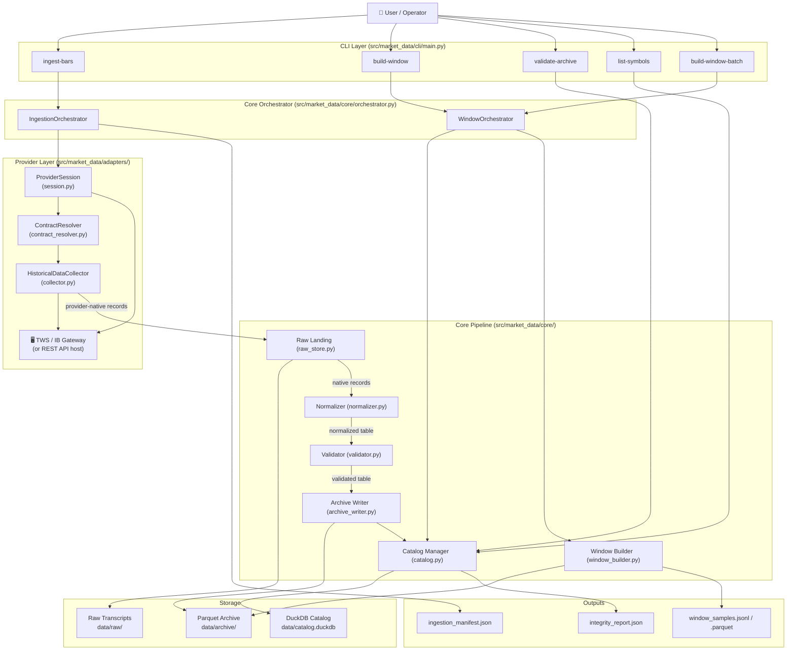

# MDRT 01 — System Architecture

> **Revision note (req-review-01):** Architecture updated to reflect Interactive Brokers as the primary
> Phase 1 provider. The provider layer is no longer a single thin adapter — it is split into
> ProviderSession, ContractResolver, and HistoricalDataCollector. The raw landing now stores
> provider-native transcripts, not pre-normalized pages. All changes are flagged with their review blocker.

## Overview

The tool has **eight logical layers** arranged in a strict linear pipeline.
Each layer has a single responsibility and communicates only with its direct neighbors.

```
CLI → Orchestrator → ProviderSession → ContractResolver → HistoricalDataCollector
    → Raw Landing → Normalizer → Validator → Archive Writer → Catalog Manager
                                                           ↕
                                               Window Builder (reads Catalog + Archive)
```

The split of the old "Provider Adapter" into three sub-layers (Session, ContractResolver, Collector)
is required by Interactive Brokers, where connection readiness, contract identity, and data retrieval
are separate, ordered concerns — not a single synchronous REST call.

---

## System Architecture Diagram



---

## Data Flow — Window Builder

```mermaid
flowchart LR
    subgraph REQ["Window Request"]
        WR["WindowRequest\nsymbol, timeframe\nanchor_ts, bars_before\nbars_after\nuse_rth, what_to_show"]
    end

    subgraph CATALOG["DuckDB Catalog Query"]
        Q["SELECT partition_paths\nFROM archive_coverage\nWHERE symbol=? AND timeframe=?\nAND use_rth=? AND what_to_show=?\nAND first_ts <= ? AND last_ts >= ?"]
        PATHS["Resolved Parquet paths"]
    end

    subgraph PYARROW["PyArrow Parquet Read"]
        DS["pq.ParquetDataset(\n  paths,\n  filters=[ts_utc range]\n)"]
        RG["Row Group Predicate\nPushdown"]
        TBL["pa.Table (filtered)"]
    end

    subgraph SLICE["Window Slice"]
        SORT["Sort by ts_utc ASC"]
        FIND["Locate anchor row"]
        CUT["Slice [N before : M after]"]
        CHK["Validate bar count\n+ gap classification"]
    end

    subgraph EXPORT["Export"]
        JSONL["window.jsonl"]
        PARQ["window.parquet"]
    end

    WR --> Q --> PATHS --> DS --> RG --> TBL
    TBL --> SORT --> FIND --> CUT --> CHK
    CHK --> JSONL & PARQ
```



> **Note:** `use_rth` and `what_to_show` are now query filters in the catalog so that windows
> never mix bars from different session semantics. See §05 and §11.

---

## Layer Responsibilities

### A. Provider Session (`ProviderSession`)

- Manages the lifecycle of the connection to the provider host
- For **IB**: opens and monitors the TCP socket to TWS / IB Gateway; waits for `nextValidId` callback before signalling readiness; handles reconnect on drop; coordinates pacing across concurrent requests
- For **REST providers** (Alpaca, Databento): a thin no-op session that validates env-var credentials with a ping call
- Provides `ensure_ready()` — blocks until the connection is confirmed ready or raises `ProviderSessionError`
- Never initiates data requests; only manages the transport

### B. Contract Resolver (`ContractResolver`)

- Converts user-supplied intent (symbol string + asset class + exchange) into a stable, provider-specific contract identity
- For **IB**: calls `reqContractDetails()` and waits for reply; stores the resolved `conId`, `localSymbol`, `primaryExchange`, `multiplier`, `tradingClass`, `expiry`
- For **REST providers**: a thin resolver that validates the symbol exists and returns a minimal `ContractResolutionRecord`
- Raises `ContractResolutionError` if the symbol cannot be unambiguously resolved
- Results are cached in `InstrumentRegistry` (DuckDB `instruments` table) to avoid repeated API calls

### C. Historical Data Collector (`HistoricalDataCollector`)

- Sends the actual data requests to the provider using the resolved contract
- For **IB**: calls `reqHistoricalData()` with `endDateTime`, `durationStr`, `barSizeSetting`, `whatToShow`, `useRTH`, `formatDate`; collects `historicalData` callbacks; signals end of data on `historicalDataEnd`
- Implements the **ChunkPlanner**: for large date ranges, decomposes the request into IB-safe chunks (≤ 1 year for daily bars; ≤ 30 days for 1-minute bars per IB pacing rules  )
- Handles inter-request pacing delays via `PacingCoordinator` (default: `IB_PACING_DELAY_SEC` = 15s; see §3.3a for full IB pacing rules)
- Returns **provider-native records** (not yet normalized); these go directly to Raw Landing
- Raises `ProviderPacingError` on pacing violation; `EmptyResponseError` on no data

### D. Raw Landing Layer (revised)

- Stores the **provider-native request/response transcript** before any transformation
- For IB: stores `RequestTranscript` (request parameters) + `CallbackTranscript` (raw callback payloads) as JSON-L per chunk
- For REST providers: stores paginated raw response JSON, compressed with gzip
- Path pattern: `data/raw/provider=<p>/symbol=<s>/batch_id=<b>/chunk_<N>_transcript.jsonl.gz`
- Purpose: debugging, replay, provider migration checking, audit
- The normalizer receives provider-native records from raw landing, NOT already-normalized data

### E. Normalizer (clarified contract)

- Receives **provider-native records** (raw field names from IB callbacks or REST JSON)
- Converts to internal `NORMALIZED_BAR_SCHEMA`
- For IB: maps `open`, `high`, `low`, `close`, `volume`, `barCount`, `WAP` fields; converts source timezone to UTC using the **TWS login timezone from `ProviderSessionInfo`** (config-only via `IB_TWS_LOGIN_TIMEZONE`; never derived from API)
- Casts all columns to exact Arrow types; adds provenance columns
- Sorts output by `ts_utc` ascending

### F. Validator (session-aware)

- **Hard failures** (raise immediately): duplicate timestamps, non-monotonic time, impossible OHLC, negative prices/volume
- **Soft warnings with gap classification**: gaps between bars are NOT all equal — the validator uses the `use_rth` and `session_calendar` context to distinguish:
  - `MARKET_CLOSED_GAP` (expected — weekend, holiday, outside RTH) → info only
  - `UNEXPECTED_GAP` (within expected trading hours) → `DATA_GAP` warning
  - `PROVIDER_ERROR_GAP` (matches an error in the callback transcript) → `PROVIDER_GAP` warning
- Produce a `ValidationReport` for every batch

### G. Archive Writer (overlap-aware)

- Writes validated normalized bars to the partitioned Parquet archive
- Partition hierarchy: `provider / asset_class / symbol / timeframe / use_rth / what_to_show / year / month`
- `use_rth` and `what_to_show` are **partition keys** — bars with different session semantics live in separate partition trees and are never mixed
- Deduplication policy: see §11 (Overlap & Deduplication Policy)
- Use `zstd` compression, `row_group_size=100_000`

### H. Catalog / Query Layer (DuckDB)

- Maintains metadata tables (8 total): `instruments`, `provider_sessions`, `request_specs`, `ingestion_batches`, `archive_file_records`, `archive_coverage`, `window_log`, `data_quality_events`
- Tracks instrument registry, request lineage, archive coverage with session semantics
- Provides overlap detection queries used by Archive Writer
- Never stores raw market data — only metadata

---

## Directory Structure

```
market_data/
├── pyproject.toml
├── README.md
├── .env.example
│
├── src/
│   └── market_data/
│       ├── __init__.py
│       ├── cli/
│       │   ├── __init__.py
│       │   └── main.py
│       ├── adapters/
│       │   ├── __init__.py
│       │   ├── base.py                   # Re-exports: ProviderSession, ContractResolver, HistoricalDataCollector ABCs
│       │   ├── session.py                # ProviderSession ABC + IbSession, RestSession
│       │   ├── contract_resolver.py      # ContractResolver ABC + IbContractResolver
│       │   ├── collector.py              # HistoricalDataCollector ABC + IbHistoricalDataCollector
│       │   ├── pacing.py                 # PacingCoordinator
│       │   ├── chunk_planner.py          # IB request chunk planning logic
│       │   ├── ib_adapter.py             # IB: wires Session + Resolver + Collector
│       │   ├── alpaca_adapter.py         # Alpaca: REST-style, thin session (Phase 2)
│       │   └── databento_adapter.py      # Databento: REST-style, thin session (Phase 2)
│       ├── core/
│       │   ├── __init__.py
│       │   ├── orchestrator.py
│       │   ├── normalizer.py
│       │   ├── validator.py              # Now session-aware (gap classification)
│       │   ├── raw_store.py              # Revised: stores transcripts
│       │   ├── archive_writer.py         # Revised: overlap-aware
│       │   ├── catalog.py
│       │   └── window_builder.py
│       ├── models/
│       │   ├── __init__.py
│       │   ├── domain.py                 # All dataclasses (expanded)
│       │   ├── schemas.py                # PyArrow schemas (expanded)
│       │   └── catalog_sql.py            # DuckDB DDL (expanded)
│       ├── config/
│       │   ├── __init__.py
│       │   └── settings.py               # Pydantic Settings (canonical location)
│       └── exceptions.py                 # Full exception hierarchy
│
├── data/                                 # Runtime data (gitignored)
│   ├── raw/                              # Provider transcripts
│   ├── archive/                          # Partitioned Parquet
│   └── catalog.duckdb
│
├── outputs/                              # Exports (gitignored)
│   ├── windows/
│   ├── integrity_reports/
│   └── manifests/
│
├── tests/
│   ├── conftest.py
│   ├── unit/
│   ├── integration/
│   └── adapters/
│       ├── cassettes/                    # REST cassettes (Alpaca, Databento)
│       └── transcripts/                  # IB callback transcript fixtures
│
└── config/
    └── settings.py                       # DO NOT USE — legacy path.
                                          # Canonical location: src/market_data/config/settings.py
```

> ⚠️ **Settings location:** The `Settings` class lives at `src/market_data/config/settings.py`,
> NOT at the repository root `config/settings.py`. The `08-configuration.md` spec is the
> authoritative reference for the settings module path.

---

## Phase 1 Dependencies (`pyproject.toml`)

```toml
[project]
name = "market-data"
requires-python = ">= 3.11"

dependencies = [
    "ibapi >= 10.19",          # Official IB TWS API (not ib_insync)
    "pyarrow >= 14.0",         # Parquet read/write + schema enforcement
    "duckdb >= 0.10",          # Catalog / metadata query
    "typer >= 0.9",            # CLI framework
    "pydantic-settings >= 2.0", # Env-var configuration
    "python-dotenv >= 1.0",    # .env file loading
]

[project.optional-dependencies]
dev = [
    "pytest >= 7.0",
    "pytest-cov >= 4.0",
    "ruff >= 0.3",
]

[project.scripts]
mdrt = "market_data.cli.main:app"
```

> **Note:** `ibapi` is the official IBKR Python SDK. It is available from PyPI
> but may also require manual installation from IBKR's download page.
> `ib_insync` is explicitly prohibited — see index.md key decisions.

---

## Partition Strategy

```
data/archive/
  provider=ib/
    asset_class=equity/
      symbol=SPY/
        timeframe=1m/
          use_rth=1/
            what_to_show=TRADES/
              year=2024/
                month=1/
                  part-0.parquet
```

**Why `use_rth` and `what_to_show` are partition keys:**
- Bars fetched with `useRTH=1` (regular trading hours only) have different timestamp coverage than `useRTH=0`
- Bars with `whatToShow=TRADES` vs `BID_ASK` vs `MIDPOINT` have entirely different price semantics
- Mixing these in the same partition would produce silently incorrect windows
- Partition separation ensures window queries are always semantically coherent

---

## Outputs Produced by a Complete Ingestion Run

| File | Location | Purpose |
|------|----------|---------|
| `*.parquet` | `data/archive/provider=.../use_rth=.../what_to_show=.../...` | Canonical normalized bar archive |
| `chunk_N_transcript.jsonl.gz` | `data/raw/provider=.../batch_id=.../` | Provider-native transcript (replay / audit) |
| `catalog.duckdb` | `data/` | Full metadata catalog |
| `ingestion_manifest_<batch_id>.json` | `outputs/manifests/` | Portable batch job record |
| `integrity_report_<timestamp>.json` | `outputs/integrity_reports/` | Quality summary |
| `<symbol>_<tf>_<anchor>.jsonl` | `outputs/windows/` | Market window export |
