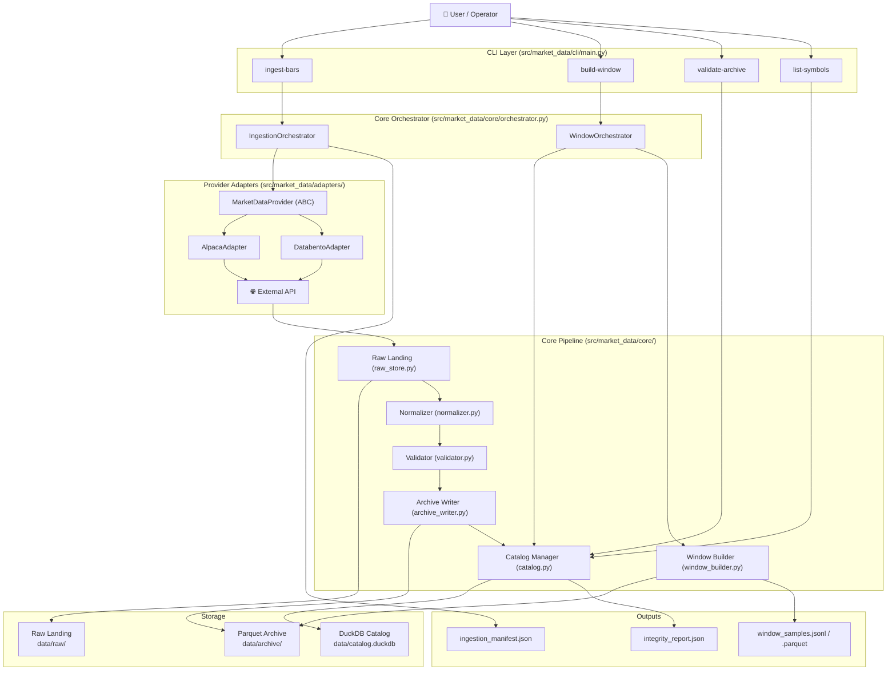

# MDRT 01 — System Architecture

## Overview

The tool has six layers arranged in a strict linear pipeline. Each layer has a single responsibility and communicates only with its direct neighbors.

```
CLI → Orchestrator → Provider Adapter → Raw Landing → Normalizer → Validator → Archive Writer → Catalog Manager
```

---

## System Architecture Diagram



---

## Data Flow — Window Builder

Shows how a window request queries DuckDB and reads only the needed Parquet row groups.

```mermaid
flowchart LR
    subgraph REQ["Window Request"]
        WR["WindowRequest\nsymbol, timeframe\nanchor_ts, bars_before\nbars_after"]
    end

    subgraph CATALOG["DuckDB Catalog Query"]
        Q["SELECT partition_paths\nFROM archive_coverage\nWHERE symbol=? AND timeframe=?\nAND first_ts <= ? AND last_ts >= ?"]
        PATHS["Resolved Parquet paths"]
    end

    subgraph PYARROW["PyArrow Parquet Read"]
        DS["pq.ParquetDataset(\n  paths,\n  filters=[ts_utc range]\n)"]
        RG["Row Group Predicate\nPushdown"]
        TBL["pa.Table (filtered)"]
    end

    subgraph SLICE["Window Slice"]
        SORT["Sort by ts_utc ASC"]
        FIND["Locate anchor row"]
        CUT["Slice [N before : M after]"]
        CHK["Validate bar count"]
    end

    subgraph EXPORT["Export"]
        JSONL["window.jsonl"]
        PARQ["window.parquet"]
    end

    WR --> Q --> PATHS --> DS --> RG --> TBL
    TBL --> SORT --> FIND --> CUT --> CHK
    CHK --> JSONL & PARQ
```



---

## Layer Responsibilities

### A. Provider Adapter

- Authenticate using env-var credentials (never accept keys as constructor args)
- Fetch raw bars, paginate through history
- Handle retries and rate limits internally
- Return a `pa.Table` conforming to `NORMALIZED_BAR_SCHEMA`
- One concrete class per provider; all share the `MarketDataProvider` ABC

### B. Raw Landing Layer

- Persist the raw response **exactly as received** (gzipped JSON or raw Parquet snapshot)
- Purpose: debugging, replay, audit, provider migration checking
- Path pattern: `data/raw/provider=<p>/symbol=<s>/batch_id=<b>/page_<N>.json.gz`

### C. Normalizer

- Convert vendor-specific field names into the single internal normalized schema
- Cast all columns to the exact types declared in `NORMALIZED_BAR_SCHEMA`
- Add provenance columns (`ingested_at`, `source_batch_id`) if not present
- Sort output by `ts_utc` ascending

### D. Validator

- **Hard failures** (raise, pipeline stops): duplicate timestamps, non-monotonic time, impossible OHLC, negative prices/volume
- **Soft warnings** (log to catalog, pipeline continues): missing intervals (gaps), low-volume anomalies, timezone inconsistencies
- Produce a `ValidationReport` for every batch

### E. Archive Writer

- Write validated normalized bars to the partitioned Parquet archive
- Partition hierarchy: `provider / asset_class / symbol / timeframe / year / month`
- Use `zstd` compression, `row_group_size=100_000`
- Write atomically (temp file → rename)

### F. Catalog / Query Layer (DuckDB)

- Maintain `ingestion_batches`, `archive_coverage`, `window_log`, `data_quality_events` tables
- Resolve partition paths for window queries
- Produce integrity reports
- Never store raw market data — only metadata

---

## Directory Structure

```
market_data/
├── pyproject.toml
├── README.md
├── .env.example
│
├── src/
│   └── market_data/
│       ├── __init__.py
│       ├── cli/
│       │   ├── __init__.py
│       │   └── main.py
│       ├── adapters/
│       │   ├── __init__.py
│       │   ├── base.py               # MarketDataProvider ABC
│       │   ├── alpaca_adapter.py
│       │   └── databento_adapter.py
│       ├── core/
│       │   ├── __init__.py
│       │   ├── orchestrator.py
│       │   ├── normalizer.py
│       │   ├── validator.py
│       │   ├── raw_store.py
│       │   ├── archive_writer.py
│       │   ├── catalog.py
│       │   └── window_builder.py
│       ├── models/
│       │   ├── __init__.py
│       │   ├── domain.py             # Dataclasses
│       │   ├── schemas.py            # PyArrow schemas
│       │   └── catalog_sql.py        # DuckDB DDL
│       └── exceptions.py
│
├── data/                             # Runtime data (gitignored)
│   ├── raw/
│   ├── archive/
│   └── catalog.duckdb
│
├── outputs/                          # Exports (gitignored)
│   ├── windows/
│   ├── integrity_reports/
│   └── manifests/
│
├── tests/
│   ├── conftest.py
│   ├── unit/
│   ├── integration/
│   └── adapters/
│
└── config/
    └── settings.py
```

---

## Partition Strategy

Parquet files are partitioned using Hive-style directory naming:

```
data/archive/
  provider=alpaca/
    asset_class=equity/
      symbol=SPY/
        timeframe=1m/
          year=2024/
            month=1/
              part-0.parquet
            month=2/
              part-0.parquet
```

**Why this shape:**
- DuckDB and PyArrow both support Hive partition filter pushdown natively — queries with a `symbol` or date range filter skip irrelevant directories entirely
- Month-level granularity keeps individual files at ~100k rows for 1-minute bars (~22 trading days × ~390 bars/day ≈ 8,580 rows/month → multiple months per file is fine; keep `row_group_size=100_000`)

---

## Outputs Produced by a Complete Ingestion Run

| File | Location | Purpose |
|------|----------|---------|
| `*.parquet` | `data/archive/provider=.../...` | The canonical normalized bar archive |
| `page_NNNN.json.gz` | `data/raw/provider=.../batch_id=.../` | Raw landing (replay / audit) |
| `catalog.duckdb` | `data/` | Metadata catalog: coverage, batches, events |
| `ingestion_manifest_<batch_id>.json` | `outputs/manifests/` | Batch job record (portable) |
| `integrity_report_<timestamp>.json` | `outputs/integrity_reports/` | Quality summary |
| `<symbol>_<tf>_<anchor>.jsonl` | `outputs/windows/` | Market window export |
